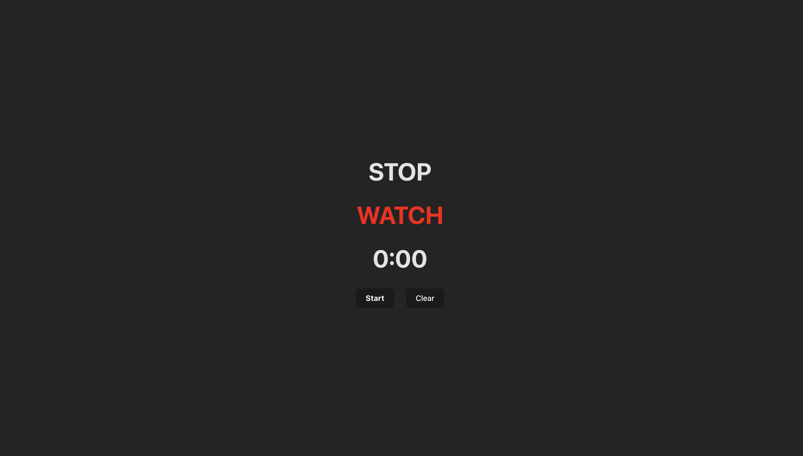

# STOP WATCH

This repository contains a simple stopwatch application built using React.js. The stopwatch allows users to start, stop, and reset the timer. It also displays the elapsed time in hours, minutes, seconds, and milliseconds.

Features
Start: Begins the stopwatch timer.
Stop: Pauses the stopwatch timer.
Reset: Resets the stopwatch timer to zero.
Display: Shows the elapsed time in hours, minutes, seconds, and milliseconds.

